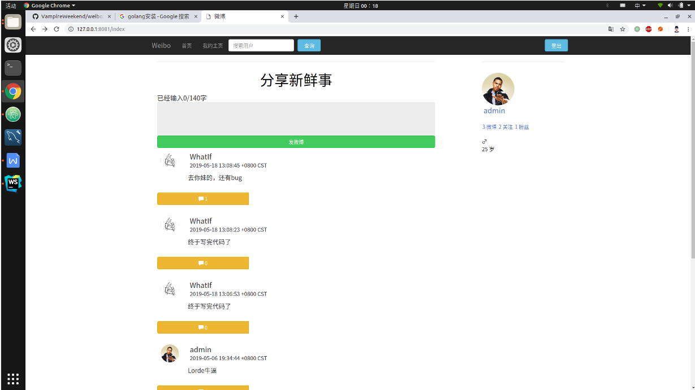

# 电子科技大学 - 系统级软件综合课程设计

## 项目简介

实现简单的微博平台，微博平台的功能包括：

（1）用户注册

（2）用户发表不超过139字的文本（即微博）

（3）用户关注和取消关注其它用户

（4）用户对微博加入评论（不超过100字）

（5）用户主页可查看关注用户和自己发表的微博

## 技术框架及开发环境

前端框架：Bootstrap , jQuery

前端开发环境： IntelliJ Webstorm

后台：基于Go语言，使用gin+gorm，gin为Web框架，gorm为Golang版本的数据库对象关系映射

数据库：MySQL 5.5

## 项目架构

```
-weibo
    |-controllers 控制器目录
    |-images README文件需要的图片
    |-models 数据库访问目录
    |-resources 数据库资源目录
    |-static 静态资源目录
        |-css css文件目录
        |-fonts 字体目录
        |-js js文件目录
        |-pic 图片目录
    |-views 网页模板目录
    |-main.go 程序执行入口
```

## 在本地运行项目

以下默认操作系统为类Unix系统

在运行项目之前，请先配置数据库。

1. 运行文件 /resources/weibo.sql

2. 在项目中的models/models.go第59行，将以下代码中的数据库配置信息改为你自己的信息

   ```go
   db, err := gorm.Open("mysql", "debian-sys-maint:#VictorOladipo#@tcp(127.0.0.1:3306)/weibo?charset=utf8&parseTime=True&loc=Local")
   //     (username):(password)@(connection_address)/weibo?charset=utf8&parseTime=True&loc=Local")
   ```


之后运行后台服务

1. 首先安装Go语言，解压安装后请设置环境变量GOPATH

    可以用go env GOPATH查看当前的GOPATH:

    ```shell script
    go env GOPATH
    ```

2. cd到GOPATH下，将本项目放进GOPATH/src/github.com/VampireWeekend当中

    ```shell script
    go get -u github.com/ZhangYW18/weibo
    cd $GOPATH/src/github.com/ZhangYW18/weibo
    go get -d -v ./...
    ```

3. 在项目根目录main.go当中将17，18行的代码的路径改为本地路径

    ```Go
    router.Static("/static", "YOUR GOPATH/src/github.com/ZhangYW18/weibo/static")
    router.LoadHTMLGlob("YOUR GOPATH/src/github.com/ZhangYW18/weibo/views/**/*")
    ```

    此外，在main.go倒数第三行可以设置项目本地运行的端口号：

    ```go
    router.Run(":8087")   // 默认为8087端口
    ```

4. cd到项目根目录，运行命令go run main.go，则可以在127.0.0.1:8087进入登录界面

## 项目示例


